# MegaCity

MegaCity is a native product plugin for [Draxul](https://github.com/cmaughan/Draxul), a cross-platform GPU terminal and agentic shell host. It scans a source tree with Tree-sitter, projects the parsed symbols into a semantic model of the codebase, and renders that model as an explorable 3D scene inside a Draxul pane — a city whose districts and buildings map to modules and types, with dependency routes, live performance heat, and test-coverage overlays layered on top. Its purpose is agent management and code analysis: a way to see and navigate what a codebase (and the agents working on it) are doing, not a rendering demo.

The plugin is loaded at runtime as a dynamic module (`dev.draxul.megacity`) over Draxul's versioned C plugin ABI, rendering with raw Vulkan on Windows and raw Metal on macOS. One plugin ships two visualization modes built on the same scanning, semantics, and scene infrastructure: **City** and **BioView**.

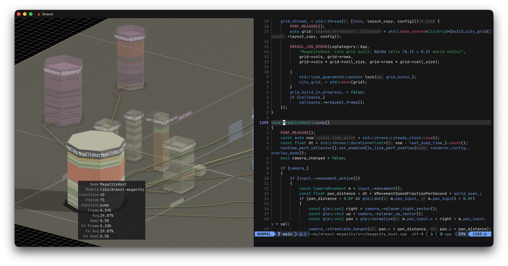

## Gallery

_Click any image to view full size._

<table>
<tr>
<td align="center"><a href="screenshots/split_panes_mac.png">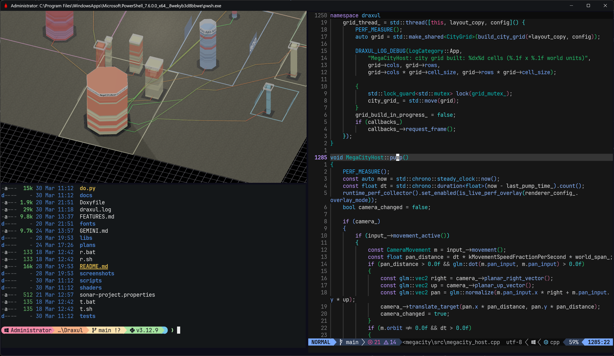</a><br><em>City view in a Draxul split pane</em></td>
<td align="center"><a href="screenshots/tree_mac.png">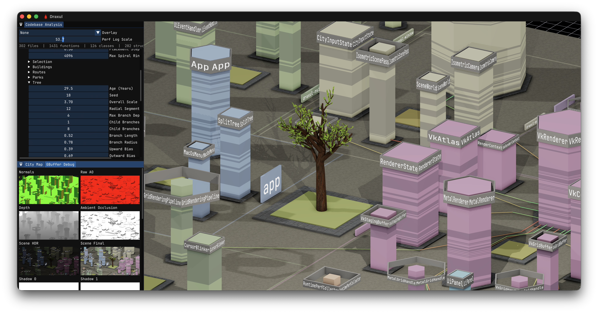</a><br><em>City view with debug overlays</em></td>
</tr>
<tr>
<td align="center"><a href="screenshots/inspection_mac.png">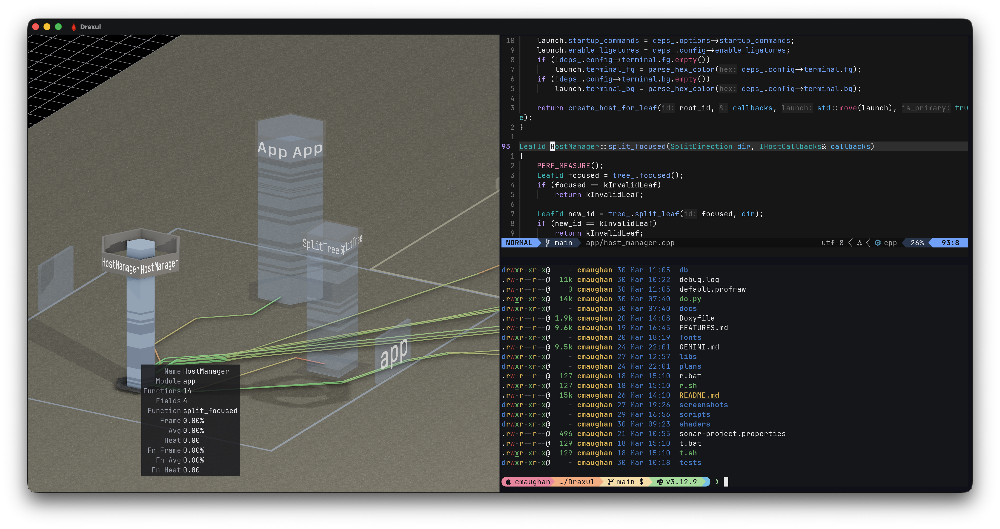</a><br><em>Building inspection panel</em></td>
<td align="center"><a href="screenshots/function_buildings_mac.png">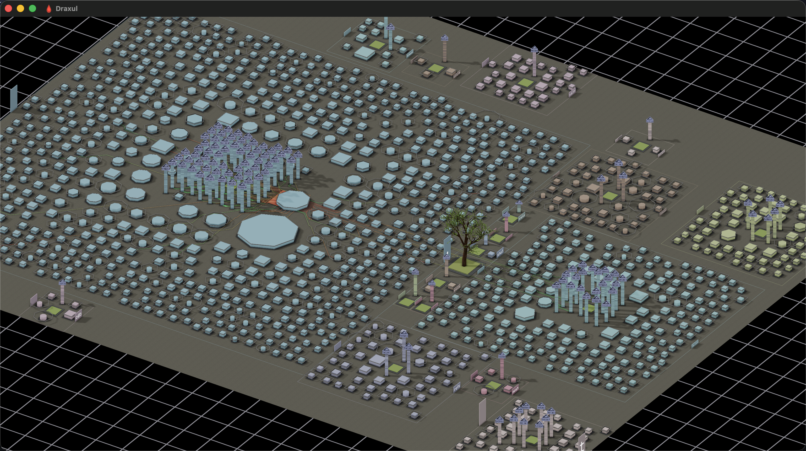</a><br><em>Visualizing Git's source code</em></td>
</tr>
<tr>
<td align="center"><a href="screenshots/app_connections_mac.png">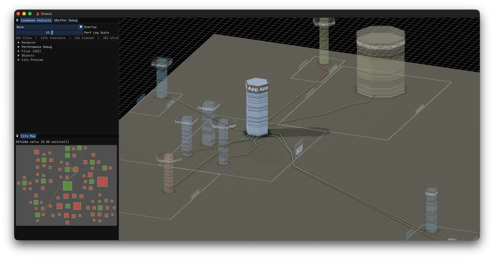</a><br><em>App module connections</em></td>
<td align="center"><a href="screenshots/renderer_connections_mac.png">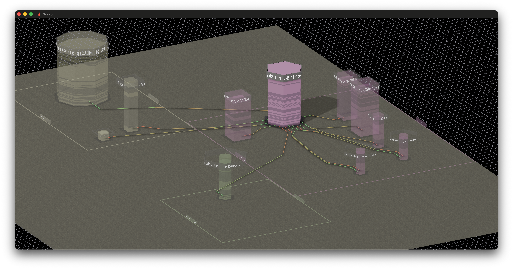</a><br><em>Renderer module connections</em></td>
</tr>
<tr>
<td align="center"><a href="screenshots/coverage_connections_mac.png">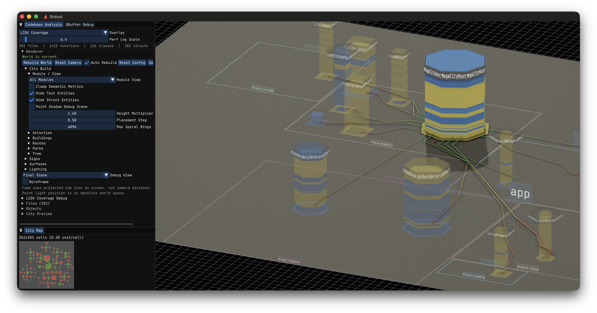</a><br><em>Coverage overlay connections</em></td>
<td align="center"><a href="screenshots/tooltip_link_mac.png">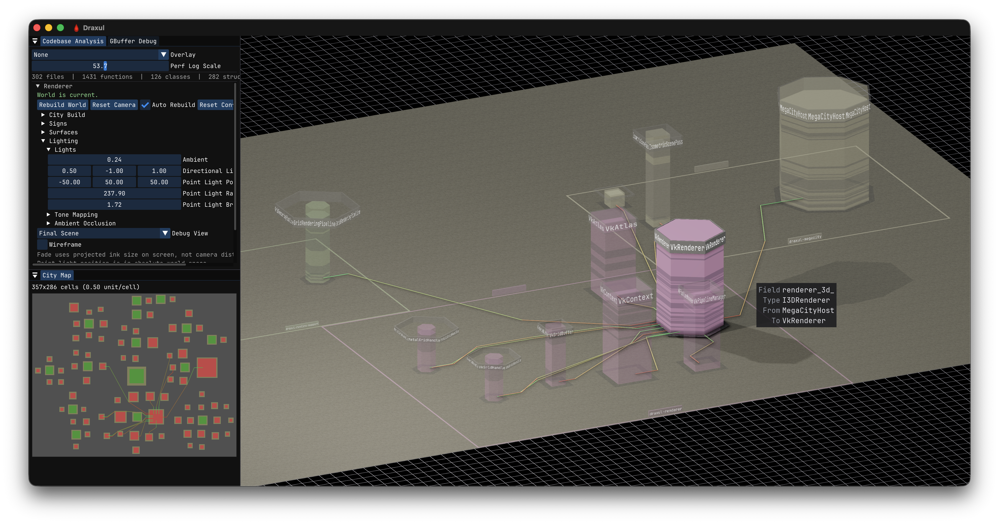</a><br><em>Tooltip with source link</em></td>
</tr>
<tr>
<td align="center"><a href="screenshots/live_coverage_pc.png">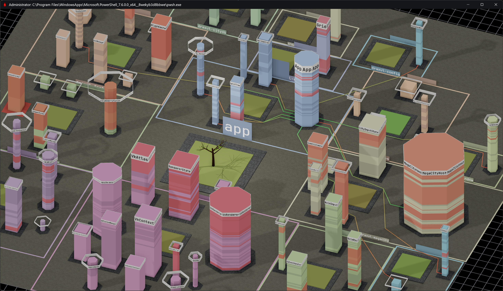</a><br><em>Live coverage overlay (Windows)</em></td>
<td align="center"><a href="screenshots/test_coverage_mac.png">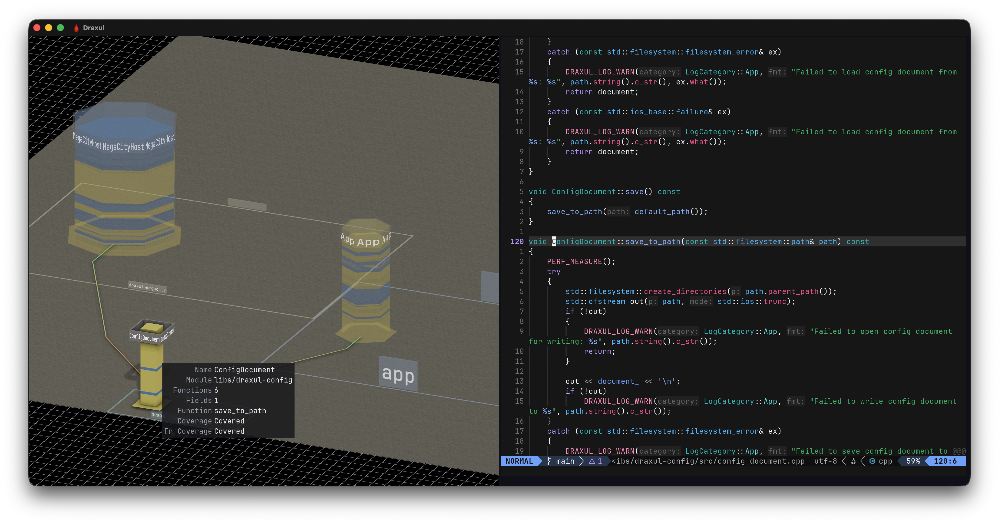</a><br><em>Test coverage heatmap</em></td>
</tr>
<tr>
<td align="center"><a href="screenshots/test_coverage_2_mac.png">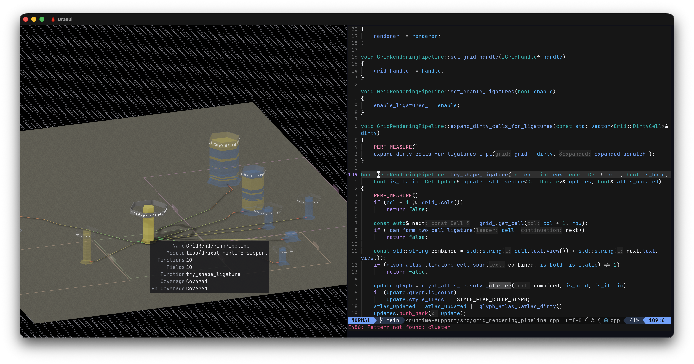</a><br><em>Test coverage detail</em></td>
<td></td>
</tr>
</table>

## Launching

From a running Draxul instance:

```text
draxul tab create --space <space-id> --name MegaCity --plugin dev.draxul.megacity --json
```

Mode and scan source are selected through the plugin config JSON (`--plugin-config`):

```text
draxul tab create --space <space-id> --name BioView \
  --plugin dev.draxul.megacity --plugin-config '{"mode":"biology"}' --json
```

| Key | Default | Meaning |
|-----|---------|---------|
| `mode` | `"city"` | `"city"` (alias `"megacity"`) or `"biology"` (alias `"bioview"`); any other value fails instance creation |
| `source` | none | Path used as the Tree-sitter scan root |
| `continuous_refresh` | `false` | Request continuous refresh from the host |
| `show_ui` | `true` | Show the plugin's ImGui panels |

`draxul pane split ... --plugin dev.draxul.megacity` works the same way for splitting an existing pane instead of creating a tab.

## Facilities

### Scanning and semantics

- A background Tree-sitter scanner (`product/draxul-treesitter`) parses the configured source root and publishes immutable parsed-symbol snapshots. The C++ grammar is bundled; tree-sitter and the grammar are fetched by `cmake/Dependencies.cmake`.
- `product/draxul-code-semantics` projects the raw parse into a neutral `CodeSemanticSnapshot` — repository, module, file, type, function, method, field, and reference nodes — and resolves repository module paths (so `app/...`, `libs/<name>/...`, `modules/<name>/...` become distinct modules). Both visualization modes build from this same snapshot.
- The presentation side uses an EnTT-based ECS world (`product/draxul-codeviz-scene`) with backend-neutral scene records and immutable scene snapshots handed from builder threads to the renderer.

### City mode

The semantic snapshot is laid out as a city: modules become districts with module-colored outlines above a shared road layer, and types become procedural buildings whose shape and metrics derive from the code — connected buildings step from 4-sided to 6-sided to 8-sided shells by incident dependency count, and same-footprint structs stack into plate buildings. Dependency references are routed as road-following polylines and emitted into the scene as raised connection strips with a source-to-target gradient. Buildings carry repeated roof-sign rings with class and module labels; a central park holds a procedurally generated tree with atlas-based PBR leaf cards.

Analysis overlays include:

- **Perf**: buildings blend toward a green-to-red heat palette per semantic function layer from a live timing snapshot, with an optional log scale for low heat values.
- **Coverage / LCOV Coverage**: executed or covered function layers light up, either from live touch data or from an imported LLVM `lcov` tracefile, with per-function coverage status in the building tooltip.
- Semantic filters (hide test entities, hide struct-backed entities), module filtering, and a debug panel with GBuffer/AO/shadow-map inspection views.

### BioView mode

Biology mode grows the whole codebase as one organism from the same `CodeSemanticSnapshot`: every module becomes a translucent tissue territory, every class or struct becomes a cell packed into its module's tissue, and strong cross-module dependency coupling becomes a blood vessel arcing between tissues, with thickness scaling by edge count. The most significant classes render as fully detailed organelle cells whose real members drive the anatomy — methods become mitochondria, fields become ribosomes, declared members become DNA base-pair rungs, the inheritance chain becomes a Golgi stack, oversized methods become lysosomes — and overall class health (method length, coupling, size) tints the membrane green to red. Every organelle carries a semantic reference back to its code node. The build is deterministic; placement is seeded from stable hashes of member names.

### Rendering

Rendering is done directly against the GPU through Draxul's plugin ABI — raw Vulkan (GLSL compiled to SPIR-V via glslc) on Windows and raw Metal (MSL compiled to metallib via xcrun) on macOS, with a shared backend-neutral `CodeVizScenePass` in `product/draxul-codeviz-renderer` and platform backends in `codeviz_render_vk.cpp` and `codeviz_render.mm`. The opaque pipeline uses cascaded directional shadow maps, point-light cubemap shadows, a depth/normal AO prepass, an MSAA `RGBA16F` HDR scene target, and tone mapping (configurable exposure and white point) into a `BGRA8 sRGB` target before present. Materials include textured asphalt roads, paving-stone sidewalks, bark-textured trees, and flat-color PBR building shells with configurable roughness/metallic. UI panels, tooltips, and debug views are drawn with ImGui through Draxul's plugin-support ImGui host.

### Interaction

Left-drag pans the scene and Alt + left-drag orbits; the camera can switch between orthographic and perspective projection, persisted in config. Buildings (including individual stacked plates) are clickable with dependency-route highlighting and configurable selection fade; holding spacebar raises hidden buildings. Hover tooltips report per-function timing and coverage detail.

## Building as part of Draxul

This repository is not built standalone. It is mounted into the Draxul build as a git submodule at `plugins/megacity` and configured by Draxul's CMake:

```bash
git clone --recurse-submodules https://github.com/cmaughan/Draxul
# or, in an existing checkout:
git submodule update --init
```

- The mount is gated by `DRAXUL_ENABLE_MEGACITY` (default `ON`). With it `OFF`, or with the submodule absent, Draxul configures and builds without any MegaCity code, shaders, assets, or tests.
- `DRAXUL_MEGACITY_PLUGIN_DIR` (default `plugins/megacity`) overrides the mount path if you want to build against a checkout elsewhere.
- Building the normal `draxul` target compiles the plugin module (`draxul-megacity.dll` / `draxul-megacity.dylib`), compiles the shaders, and stages the module, manifest, compiled shaders, and `assets/` into Draxul's bundled-plugin package automatically. There is no separate install step.

Plugin-private dependencies (EnTT, tree-sitter, the tree-sitter C++ grammar) are fetched by this repository's `cmake/Dependencies.cmake` and exist only when the mount is enabled.

## Layout

| Path | Contents |
|------|----------|
| `CMakeLists.txt` | Plugin module target, shader compilation (GLSL and MSL), and registration into Draxul's bundled-plugin packaging |
| `plugin.toml` | Plugin manifest: id `dev.draxul.megacity`, ABI version, per-platform library names |
| `src/` | `megacity_plugin.cpp` — the C ABI entry points and config parsing |
| `product/draxul-geometry` | Renderer-independent procedural mesh generation and shared `GeometryMesh` data (deterministic, GLM-based) |
| `product/draxul-treesitter` | Background source scanning and raw parsed-symbol snapshots |
| `product/draxul-code-semantics` | Projection into the neutral `CodeSemanticSnapshot`; module path resolution |
| `product/draxul-codeviz-scene` | Backend-neutral scene records, presentation ECS world, scene snapshot helpers |
| `product/draxul-codeviz-renderer` | Shared `CodeVizScenePass` plus Vulkan and Metal backends |
| `product/draxul-codeviz-host` | Shared camera and input helpers for code visualization hosts |
| `product/draxul-megacity` | Host lifecycle, configuration, semantic layout, city and biology builders, ImGui panels |
| `shaders/` | GLSL (Vulkan) and MSL (Metal) sources: scene, GBuffer, AO, shadows, post/tone-map, tooltip, debug |
| `assets/textures/` | PBR material textures (roads, sidewalks, bark, leaf atlases) staged into the plugin package |
| `tests/` | The focused plugin test suite (scene host/layout/world, geometry, Tree-sitter, config, coverage import) |
| `tools/` | `split_leafset.py` — splits a leafset texture atlas into per-leaf PBR maps using the opacity map |
| `cmake/` | `Dependencies.cmake` (EnTT, tree-sitter) and `Tests.cmake` (test target wiring) |
| `product/AGENTS.md` | Agent guide with module boundaries, threading, and validation rules for this codebase |

The dependency direction between the product libraries is approximately:

```text
draxul-geometry -----------------------> draxul-codeviz-scene -> draxul-codeviz-renderer -> draxul-megacity
                                      \-> draxul-codeviz-host ----------------------------^
draxul-treesitter -> draxul-code-semantics -----------------------------------------------^
```

## Testing

The suite in `tests/` is registered into Draxul's ctest as the `draxul-test-megacity` target, split into shards (`draxul-test-megacity-shard-0`, `-shard-1`) labeled `unit;megacity`. From a configured Draxul build:

```bash
cmake --build build --target draxul-test-megacity
ctest --test-dir build -R draxul-test-megacity --output-on-failure
```

The test binary can also be run directly (it is a Catch2-style runner; `--reporter compact` works). Pure layout, mesh generation, and semantic projection are deterministic and test without a window or GPU.

## Relationship to Draxul

The dependency is strictly one-way: this plugin consumes Draxul's public C plugin SDK plus a small allowlist of `Draxul::PluginSupport::*` libraries (ImGui and runtime support), and nothing else. The plugin is registered with strict dependency checking — Draxul's configure step fails if any product target here links a non-allowlisted Draxul target, and Draxul's own libraries and executable must never depend on anything in this repository. At runtime the versioned C ABI is the only boundary; no C++ types cross it, and the host never statically registers MegaCity.

This repository was split out of the Draxul monorepo. The deep pre-split history of these files remains in the [Draxul](https://github.com/cmaughan/Draxul) repository.
